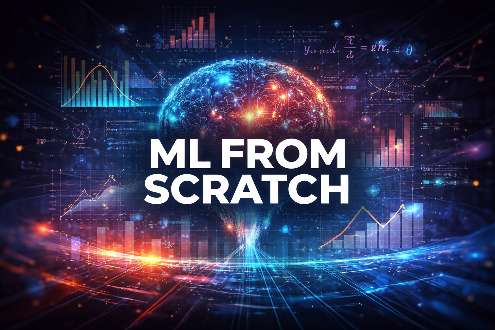

# ML and Math from Scratch

  

## 📌 Description
Implementing core math, statistics, and machine learning algorithms from scratch to deeply understand how they work under the hood.

## 🚧 Project Status
In progress – early stage.

The project is being developed alongside my learning journey in:
- Machine Learning 
- Statistics and Probability.
- Linear Algebra
- Algorithms

## ⚙️ Current Implementation
- Mean (function, tests, examples, benchmark)

## 🔜 Next Step
Descriptive Statistics:
- Median
- Mode
- Min, max, range
- Variance
- Standard deviation
- Percentiles
- Correlation

## 🧩 Planned Modules

 ### 📊 Statistics

 Core statistical, distribution and probability concepts

 ### ➗ Linear Algebra

 Vectors, matrices and operations

 ### 🤖 Machine Learning

 Fundamental algorithms

### ⚡Algorithms (optional)

Sorting and optimization techniques

## 🎯 Goal

- Deeply understand core concepts
- Strengthen problem-solving and analytical thinking
- Build strong intuition for math used in ML
- Learn how things work under the hood

## 📖 Learning Approach

 Each module contains:
- Theory
- Implementation from scratch
- Tests
- Demos / examples
- Bonus: Benchmark vs NumPy

## 🛠️ Tech Stack

- Python
- pytest
- NumPy (benchmarking)

## 👨‍💻 Author

Michał Ryzio